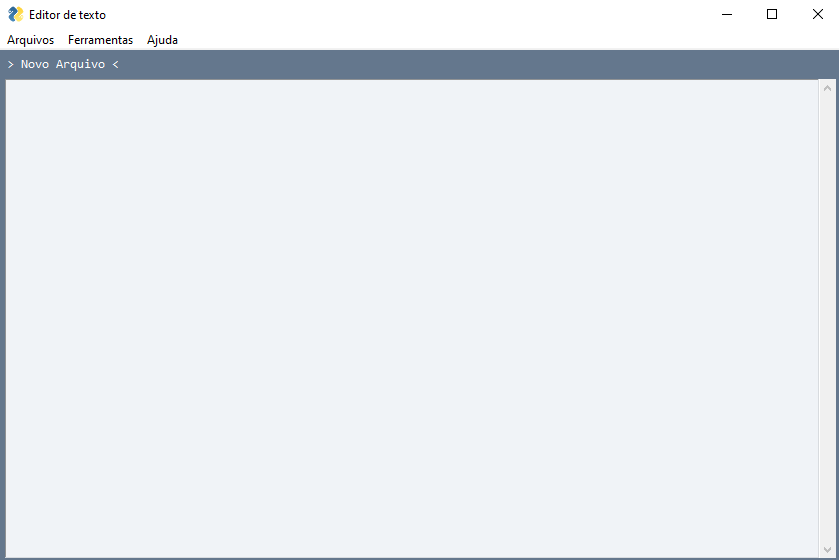

# Editor de texto
Editor de texto com python e as bibliotecas: PySimpleGui e  pathlib   | 
  

   
  
  
  ### Como usar:
  
   #### Usando o executavel:
    Abra o arquivo programa.exe
  
  #### Comandos para usar o código python:
  ##### 1. Instalar as bibliotecas:
  ###### 1.1 PySimpleGui
    pip install pysimplegui
 ###### 1.2 pathlib
    pip install pathlib
  ##### 2. Abrir o arquivo: codigo-fonte.py
  
  ☕ Veja mais!  
   
  
    
